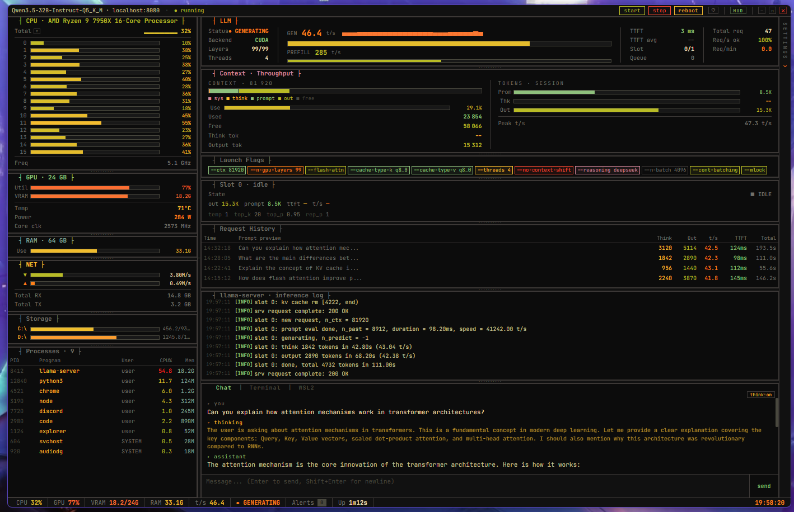
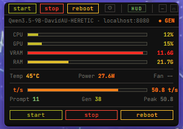

# LlamaControl

**A TUI-style desktop control panel for llama-cpp-server.**



**Mini HUD widget -- always-on-top, draggable**



---

## Overview

LlamaControl is an Electron desktop application that provides a real-time, terminal-inspired dashboard for managing and monitoring a local [llama.cpp](https://github.com/ggerganov/llama.cpp) inference server. It combines full system telemetry (CPU, GPU, RAM, disk, network, processes), LLM server lifecycle control, a streaming chat interface with reasoning/thinking token support, and integrated terminal emulators -- all in a single, resizable TUI layout.

---

## Features

### System Monitoring

- **Per-core CPU utilization** with real-time gauges, sparkline history, and automatic hardware name detection
- **NVIDIA GPU telemetry** -- utilization, VRAM usage, temperature, power draw, core clock, and fan speed via NVML
- **RAM and swap** usage with percentage gauges
- **Network throughput** -- live download/upload rates (MB/s), cumulative RX/TX totals
- **Disk partitions** -- usage bars for all mounted volumes
- **Top processes table** -- PID, name, user, CPU%, memory; right-click context menu to kill any process
- **Peak tracking** -- session-wide peak values for CPU, GPU utilization, GPU temperature, GPU power, VRAM, RAM, and generation speed

### LLM Server Management

- **Start / Stop / Reboot** the llama-server process directly from the title bar or mini HUD
- **Auto-start on launch** -- optional setting to boot the server when the app opens
- **GGUF model scanner** -- recursively scans a configured models directory, auto-detects companion files (Jinja chat templates, mmproj vision projectors) alongside each GGUF
- **Model selection** with size display and automatic companion file association
- **Server health polling** via the `/health` endpoint with configurable poll interval (1s to 5s)
- **Prometheus metrics ingestion** -- parses the `/metrics` endpoint for live tokens/second, prefill speed, KV cache ratio, request counts, and decode totals
- **Slot monitoring** -- reads `/slots` for per-slot state, token counts, and generation settings
- **Launch flags display** -- dynamic badge strip showing the exact CLI flags the server was started with

### Inference Parameters

- **Full sampling control** -- temperature, top_p, top_k, min_p, repeat_penalty, repeat_last_n, frequency_penalty, presence_penalty, n_predict, and seed
- **Block gauge controls** -- click-and-drag or scroll-wheel adjustment with ASCII block character visualization
- **Sampler ordering** -- drag-to-reorder list for the sampler pipeline (top_k, tfs_z, typical_p, top_p, min_p, temperature)
- **Stop sequences** -- add, remove, and manage custom stop tokens
- **System prompt editor** -- multi-line textarea, apply to chat or clear conversation
- **Chat template selector** -- Jinja (file), ChatML, Llama 3, Mistral, DeepSeek 3, Qwen 2.5, Gemma
- **Reasoning mode toggle** -- enable/disable DeepSeek-format thinking tokens

### Server Configuration

- **Context size** (n_ctx), batch size (n_batch), GPU layers (n_gpu_layers), and thread count via block gauges
- **Flash attention**, no_context_shift, continuous batching, and mlock toggles
- **KV cache quantization** -- selectable cache_type_k and cache_type_v (f16, q8_0, q4_0, q4_1)
- **CUDA environment flags** -- CUDA graph optimization and CUBLAS FP16 compute toggles
- **Server executable and models directory paths** -- editable from the settings panel
- **Apply and restart** -- one-click save and reboot

### Profile System

- **Multiple named profiles** -- each stores the complete configuration: model path, server params, performance flags, chat/sampling settings, reasoning mode, system prompt, samplers, and stop sequences
- **Built-in presets** -- "Thinking General" (broad reasoning), "Thinking Code" (precise low-temperature coding), "Fast Chat" (thinking off, quick responses)
- **Save as / delete** -- duplicate the current profile under a new name, or remove unused profiles
- **Profile switching** -- instant swap with automatic settings reload and UI sync
- **Persistent configuration** -- saved as JSON in the Electron userData directory

### Chat Interface

- **Streaming SSE** -- real-time token-by-token display via Server-Sent Events against the OpenAI-compatible `/v1/chat/completions` endpoint
- **Thinking/reasoning token display** -- reasoning_content tokens (DeepSeek format) rendered in a separate "thinking" block above the assistant response, with a toggle to show/hide
- **Animated cursor** during generation
- **Stop generation** -- click the send button (which becomes "stop") or abort the stream mid-response
- **Chat history** -- full conversation context maintained across turns
- **System prompt injection** -- prepend a system message to the conversation

### Context and Throughput Dashboard

- **Stacked context bar** -- color-coded segments for system, thinking, prompt, output, and free tokens
- **Context usage gauge** with percentage and token counts
- **Session token totals** -- prompt, thinking, and output tokens with proportional gauges
- **Generation speed** (t/s) and prefill speed (t/s) with large readout, gauge bar, and sparkline history
- **Peak t/s tracking** across the session
- **TTFT** (Time to First Token) -- current and running average, sourced from both chat stream timings and Prometheus metrics

### Request History

- **Tabular log** of recent requests with timestamp, prompt preview, thinking token count, output token count, t/s, TTFT, and total duration
- Automatically populated from each completed chat exchange

### Inference Log Viewer

- **Tailing log display** from the llama-server stdout/stderr log file
- Automatic log level detection (INFO, WARN, ERR, DBG) with color coding
- New-line highlight flash on arrival
- Configurable maximum visible lines

### Alert System

- **Configurable thresholds** for CPU, GPU utilization, GPU temperature, VRAM, and RAM
- **KV cache warnings** at 80% and critical alerts at 90%
- **Stall detection** -- alerts when a processing slot produces no new tokens for an extended period
- **Visual flash animations** on the relevant panel (warning amber, critical red)
- **Alert badge** in the status bar with count
- **System health popup** -- click the alert badge to see session peak values and a scrollable alert history; one-click clear

### App Settings

- Configurable alert thresholds, polling interval, max log lines, auto-start behavior, and interface color theme
- **Selectable UI themes** -- switch between Gruvbox, Nord, Forest, and Ember from the title-bar gear menu
- Persisted in localStorage independently of the profile/config system

### Terminal Integration

- **PowerShell terminal** -- full interactive PowerShell session via xterm.js and node-pty
- **WSL2 terminal** -- launch a WSL2 shell in a second tab
- **Themed to match** the active UI palette (Gruvbox, Nord, Forest, or Ember) with JetBrains Mono and a blinking cursor
- **Auto-fit** on resize with ResizeObserver
- **Fallback** to child_process.spawn if node-pty is unavailable

### Mini HUD / Widget Mode

- **Compact floating widget** showing CPU, GPU, VRAM, RAM gauges, GPU temperature/power/fan, and t/s with prompt/gen/peak token counts
- **Always-on-top** -- window shrinks and pins above other applications
- **Draggable** within the screen
- **Server controls** (start/stop/reboot) available directly in the mini HUD
- Toggle back to the full dashboard at any time

### Resizable TUI Layout

- **Three-column layout** -- sidebar (system metrics), center (LLM dashboard + chat/terminal), right (settings)
- **Vertical drag handles** between sidebar/center and center/settings columns
- **Horizontal drag handles** between every panel in each column
- **Layout persistence** -- panel sizes saved to localStorage and restored on next launch
- **Collapsible settings panel** -- folds into a vertical tab to maximize workspace
- **Frameless window** with custom title bar, minimize/maximize/close buttons, and drag region

### Status Bar

- Live CPU, GPU, VRAM, RAM readings
- Current t/s and LLM status
- Alert badge with count
- Session uptime counter
- Real-time clock

### Export

- **Copy launch command** -- generates the full llama-server CLI invocation from current settings to clipboard
- **Copy as JSON** -- exports the current inference parameters as a JSON object to clipboard

---

## Prerequisites

- **Node.js** >= 18 and **npm**
- **Python 3** with the following packages:
  - `psutil`
  - `pynvml` (optional, required for NVIDIA GPU metrics)
- **llama.cpp** built with server support (`llama-server` or `llama-server.exe`)
- **NVIDIA GPU + CUDA** (optional but recommended for GPU offloading and GPU telemetry)
- **Windows 10/11, macOS, or Linux** -- process management is cross-platform. WSL2 terminal tab is Windows-only (requires WSL installed); on other platforms the terminal tab launches the default shell.

---

## Installation

```bash
# Clone the repository
git clone https://github.com/b7216309-jpg/LlamaControl.git
cd LlamaControl

# Install Node.js dependencies (Electron, xterm.js, node-pty)
npm install

# Install Python dependencies for the companion metrics server
pip install psutil pynvml
```

### Build node-pty (if needed)

`node-pty` requires native compilation. On Windows, ensure you have the
[Visual Studio Build Tools](https://visualstudio.microsoft.com/visual-cpp-build-tools/)
with the "Desktop development with C++" workload installed, then:

```bash
npm rebuild node-pty
```

---

## Usage

### Launch the application

```bash
npm start
```

This opens the LlamaControl window and automatically starts the Python companion server for system metrics collection.

### Connect to llama-server

1. Open the **Settings** panel (right column, or click the gear icon in the title bar).
2. Optional: open **App Settings** from the gear icon to choose the interface color theme.
3. Under **Paths & CUDA**, set the path to your `llama-server` executable and your models directory.
4. Under **Model**, click **rescan models** to discover all `.gguf` files. Select the model you want to load.
5. Adjust server and generation parameters as needed.
6. Click **apply & restart server**, or use the **start** button in the title bar.

The dashboard will begin polling the server's `/health`, `/metrics`, and `/slots` endpoints and display live telemetry.

### Chat

Switch to the **Chat** tab in the bottom panel. Type a message and press Enter (or click **send**). Tokens stream in real-time. If reasoning mode is enabled, thinking tokens appear in a collapsible block above the response.

### Terminal

Click the **Terminal** tab for an integrated PowerShell session, or **WSL2** for a Linux shell. Both support full interactive use including color output and resize.

### Mini HUD

Click the **HUD** button in the title bar to collapse the window into a compact, always-on-top widget showing key metrics and server controls. Click **HUD** again to restore the full view.

---

## Configuration

### Profiles

LlamaControl uses a profile-based configuration system. Each profile stores:

| Category     | Parameters                                                                           |
|--------------|--------------------------------------------------------------------------------------|
| Model        | GGUF path, alias, chat template file, mmproj file                                    |
| Server       | host, port, context size, GPU layers, threads, batch size                             |
| Performance  | flash attention, KV cache quantization (K/V), CUDA graph opt, CUBLAS FP16            |
| Reasoning    | enabled/disabled, format (deepseek)                                                  |
| Chat         | temperature, top_p, top_k, min_p, penalties, seed, n_predict, samplers, stop, system prompt |
| Flags        | no_context_shift, continuous batching, mlock, extra CLI args                          |

The configuration file is stored at:

```
%APPDATA%/llama-control/config.json
```

### App Settings

Separate from profiles, app-level settings are stored in the browser's localStorage. This includes alert thresholds, poll interval, max log lines, auto-start, and the selected interface theme.

---

## Architecture

```
+-------------------+       IPC (contextBridge)       +--------------------+
|   index.html      | <-----------------------------> |     main.js        |
|   (Renderer)      |                                 |   (Main Process)   |
|                   |                                 |                    |
|  - Full SPA UI    |     preload.js exposes          |  - Server lifecycle|
|  - Vanilla JS     |     window.api with             |  - Config I/O      |
|  - xterm.js       |     invoke/on handlers          |  - PTY management  |
|  - SSE chat       |                                 |  - Companion spawn |
+-------------------+                                 +--------------------+
        |                                                      |
        | fetch (SSE)                                          | spawn
        v                                                      v
+-------------------+                                 +--------------------+
|  llama-server     |                                 |   companion.py     |
|  (localhost:8080) |                                 |  (localhost:8765)  |
|                   |                                 |                    |
|  /v1/chat/comp.   |                                 |  JSON system       |
|  /health          |                                 |  metrics via HTTP  |
|  /metrics         |                                 |  (psutil + pynvml) |
|  /slots           |                                 |                    |
+-------------------+                                 +--------------------+
```

- **Renderer process** (`index.html`) -- a single-page application built entirely with vanilla JavaScript and CSS. No framework. Approximately 2600 lines covering the full UI, chart logic, settings management, chat SSE client, terminal initialization, and resize engine.
- **Main process** (`main.js`) -- manages the Electron window (frameless, custom chrome), spawns/stops the llama-server and companion.py, handles IPC for config persistence, server control, PTY terminals, and proxies metrics from the companion and llama-server.
- **Preload** (`preload.js`) -- exposes a secure `window.api` bridge via Electron's contextBridge, mapping IPC invoke/on calls for all features.
- **Companion** (`companion.py`) -- a lightweight Python HTTP server on port 8765 that collects system metrics (CPU per-core, GPU via NVML, RAM, swap, disk, network, top processes) and serves them as JSON.

---

## Tech Stack

| Layer            | Technology                                                        |
|------------------|-------------------------------------------------------------------|
| Desktop shell    | [Electron](https://www.electronjs.org/) 35                       |
| Terminal         | [xterm.js](https://xtermjs.org/) 6 + [node-pty](https://github.com/nicknisi/node-pty) 1.x |
| UI               | Vanilla HTML/CSS/JS (no framework), JetBrains Mono font          |
| Color scheme     | Selectable presets: Gruvbox, Nord, Forest, Ember                  |
| System metrics   | Python 3 + [psutil](https://github.com/giampaolo/psutil) + [pynvml](https://github.com/gpuopenanalytics/pynvml) |
| LLM backend      | [llama.cpp](https://github.com/ggerganov/llama.cpp) server (OpenAI-compatible API) |
| Chat protocol    | Server-Sent Events (SSE) streaming                               |
| IPC              | Electron contextBridge + ipcRenderer/ipcMain                     |

---

## License

MIT
